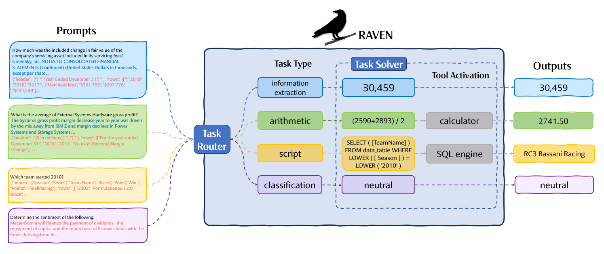

## Equipping Language Models with Tool Use Capability for Tabular Data Analysis in Finance

<p>
    <a href="https://www.python.org/">
        
    </a>
    <a href="https://github.com/adriantheuma/llama2-raven/blob/main/LICENCE">
        
    </a>
    <a href="https://huggingface.co/adriantheuma/raven-lora" target="_blank">
        
    </a>
    <a href="https://huggingface.co/adriantheuma/raven-data" target="_blank">
        
    </a>
</p>



## Overview

This repository is based on our publication *Equipping Language Models with Tool Use Capability for Tabular Data Analysis in Finance* ([PDF](https://browse.arxiv.org/pdf/00000.pdf)). It contains code to fine-tune the base [Llama 2 13B Chat](https://huggingface.co/meta-llama/Llama-2-13b) using LoRA with a curated table-and-text and sentiment analysis dataset in the financial domain. It also includes a demo gradio user interface to interact with the model. If you use this code or data in your work, please cite:

```
@misc{theuma2024equipping,
      title={Equipping Language Models with Tool Use Capability for Tabular Data Analysis in Finance}, 
      author={Adrian Theuma and Ehsan Shareghi},
      year={2024},
      eprint={2401.15328},
      archivePrefix={arXiv},
      primaryClass={cs.CL}
}
```

## Data & Templates

For data that was used to train the LoRA weights visit the [dataset](https://huggingface.co/datasets/adriantheuma/raven-data) repository. It is also possible to experiment with different prompt templates. Simply copy one of the existing templates in the templates/ folder and modify with your own prompts. More details can be found [here](/templates/README.md). 


## Setup

Create virtual env, for example with conda

```
conda create -n llama2-raven python=3.9
conda activate llama2-raven
```

Clone this repo and install dependencies

```
git clone https://github.com/adriantheuma/llama2-raven.git
pip install -r requirements.txt
```

## Run Demo

Example:

```
python generate_interface.py \
    base_model meta-llama/Llama-2-13b-chat-hf \
    lora_weights adriantheuma/raven-lora \
    dataset_name adriantheuma/raven-data \
    dataset_split test \
    prompt_template = raven_prompt_template \
    use_peft True
```

See details with command `python generate_interface.py -h`

## Supervised Fine-tuning

Example:

This fine-tuning approach was performed on a single RTX 4090 24GB GPU

```
python finetune.py \
    --base_model meta-llama/Llama-2-13b-chat-hf \
    --dataset_name adriantheuma/raven-data \
    --prompt_template_name raven_prompt_template \
    --per_device_train_batch_size 1 \
    --per_device_eval_batch_size 1 \
    --gradient_accumulation_steps 128 \
    --num_epochs 5
```
See details with command `python finetune.py -h`


## References
Our Llama LoRA training code is based on [tloen/alpaca-lora](https://github.com/tloen/alpaca-lora)